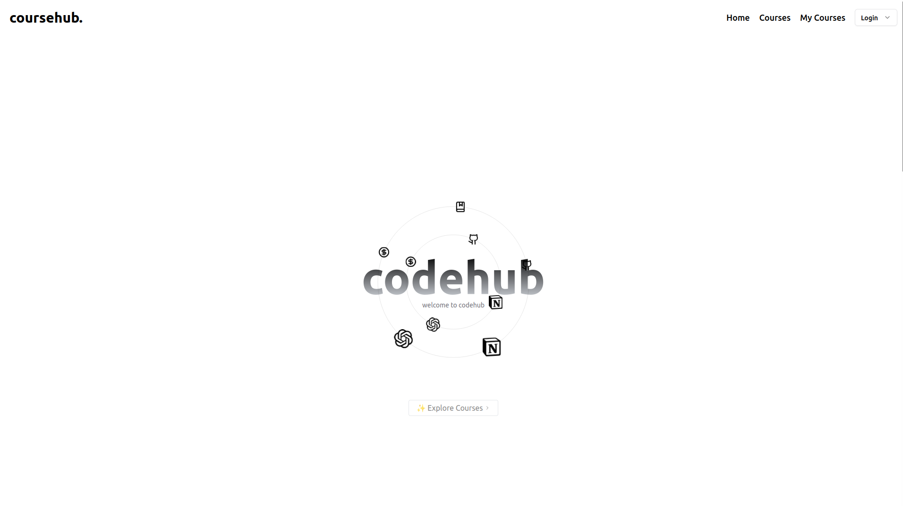

# CourseHub - Full Stack Course Selling Website

## Overview
CourseHub is a full-stack course-selling platform built using React, TailwindCSS, and Vite on the frontend and Express, MongoDB, and Node.js on the backend. This platform allows users to explore and purchase courses, while providing admins with functionality to manage courses and view revenue stats.

---

## Features

### Frontend Features:
- **Course Exploration**: Users can view available courses and search for them by name.
- **Course Purchase**: Users can purchase courses directly from the platform.
- **User Authentication**: Login/Logout functionality for both users and admins.
- **Responsive Design**: TailwindCSS for responsive and modern design.
- **Charts and Stats**: Admin can view detailed stats on revenue and users' engagement using charts.

### Admin Features:
- **Course Management**: Admin can create, update, and delete courses.
- **Revenue Stats**: Admin can view stats related to course revenue and buyers.
- **Dashboard**: Admin dashboard for course and revenue management.

---

## Technologies Used

### Frontend:
- **React**: JavaScript library for building user interfaces.
- **TailwindCSS**: A utility-first CSS framework for styling.
- **Vite**: Next-generation front-end tool for building and bundling the application.
- **Recharts**: A chart library for displaying stats and data.

### Backend:
- **Node.js**: JavaScript runtime for building the backend.
- **Express**: Web framework for Node.js.
- **MongoDB**: NoSQL database for storing user, course, and purchase data.
- **Mongoose**: ODM for interacting with MongoDB.
- **JWT (JSON Web Tokens)**: For user authentication and protecting routes.
- **Bcrypt**: For password hashing and secure user authentication.

---

## Installation

### Prerequisites
- Node.js (v16 or higher)
- MongoDB (running locally or using a cloud instance like MongoDB Atlas)
  
### Setup Instructions

1. **Clone the repository**:
   ```bash
   git clone https://github.com/yourusername/coursehub.git
   ```

2. **Navigate to the frontend directory**:
   ```bash
   cd coursehub/frontend
   ```

3. **Install frontend dependencies**:
   ```bash
   npm install
   ```

4. **Navigate to the backend directory**:
   ```bash
   cd ../backend
   ```

5. **Install backend dependencies**:
   ```bash
   npm install
   ```

6. **Configure environment variables**:
   Create a `.env` file in the `backend` directory with the following variables:
   ```env
   MONGO_URI=your_mongodb_connection_string
   JWT_SECRET=your_jwt_secret
   ```

7. **Run the application**:
   - For frontend:
     ```bash
     npm run dev
     ```
   - For backend:
     ```bash
     npm run dev
     ```

---

## Usage

- **Frontend**: Navigate to `http://localhost:3000` to access the course listing and user dashboard. Use the login form to log in as a user or admin.
  
- **Backend**: API routes are available for course creation, user login, and revenue stats.
  
---

## License
This project is licensed under the MIT License.

---

## Future Improvements
- Add more user roles with different permissions (e.g., instructors).
- Integrate payment gateway (e.g., Stripe) for course purchases.
- Improve admin dashboard with detailed reports and export options.


## Preview
